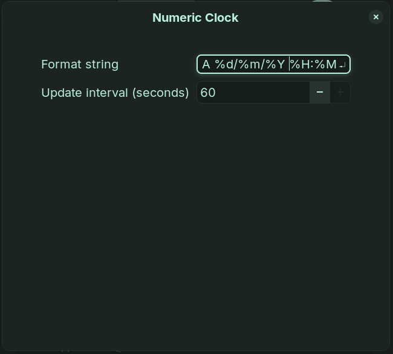
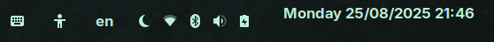

# Numeric Clock (GNOME Shell Extension)

**Quick links:**  
• **GNOME Extensions (E.G.O.):** https://extensions.gnome.org/extension/8566/numeric-clock/  
• **Latest Release (ZIP):** https://github.com/nickotmazgin/Linux-Numeric-Date-And-Clock/releases/latest  
• **Issues / feedback:** https://github.com/nickotmazgin/Linux-Numeric-Date-And-Clock/issues

A lightweight GNOME Shell extension that replaces the top-bar clock with a numeric, fully configurable format (e.g., `DD/MM/YYYY HH:MM`). Works on **Wayland and Xorg** (tested on **GNOME 42–45**). Licensed under MIT.

**UUID:** `numeric-clock@nickotmazgin`

## Screenshots

Top-bar result and preferences dialog:

**Preferences**:



**Top bar**:



## Features

* Fully numeric date/time (you choose the format string).
* **Instant-apply** preferences — no OK/Save button; changes apply as you type.
* Configurable **update interval** (seconds).
* Plays nice with panels that also draw a clock (e.g., Zorin taskbar) by updating all visible labels.
* Safe text rendering (forces plain text; no Pango markup).

## Compatibility

* GNOME Shell **42, 43, 44, 45**
* Sessions: **Wayland** and **Xorg**

---

````markdown
## Install

### A) From **extensions.gnome.org** (recommended)

The extension will be available on E.G.O. soon.  
Open **Extensions** (or **Extension Manager**) → **Browse** and search for **“Numeric Clock”** (UUID: `numeric-clock@nickotmazgin`) → toggle **On** → **Preferences** to configure.

---

### B) From a **GitHub release**

**Option 1 — specific version (v1.1.0):**

1) Download the attached asset from the release page:  
   https://github.com/nickotmazgin/Linux-Numeric-Date-And-Clock/releases/tag/v1.1.0  
   (file: `numeric-clock@nickotmazgin.shell-extension.zip`)

2) Install & open preferences:
```bash
gnome-extensions install --force numeric-clock@nickotmazgin.shell-extension.zip
gnome-extensions enable numeric-clock@nickotmazgin
gnome-extensions prefs numeric-clock@nickotmazgin
````

**Option 2 — always get the latest:**

```bash
# Download the latest release asset
curl -L -o /tmp/numeric-clock@nickotmazgin.shell-extension.zip \
  https://github.com/nickotmazgin/Linux-Numeric-Date-And-Clock/releases/latest/download/numeric-clock@nickotmazgin.shell-extension.zip

# Install & open preferences
gnome-extensions install --force /tmp/numeric-clock@nickotmazgin.shell-extension.zip
gnome-extensions enable numeric-clock@nickotmazgin
gnome-extensions prefs numeric-clock@nickotmazgin
```

**Verify checksum (optional, for v1.1.0):**

```bash
sha256sum numeric-clock@nickotmazgin.shell-extension.zip
# Expected:
# 5d1fe9b755fbfcef3d539a63b888ff376717cf88091a3de851845aafd3b74c8d
```

---

### C) From source (developer install)

```bash
# Clone this repo
git clone https://github.com/nickotmazgin/Linux-Numeric-Date-And-Clock.git
cd Linux-Numeric-Date-And-Clock/numeric-clock@nickotmazgin

# Compile local schema (dev installs only; do NOT commit the compiled file)
glib-compile-schemas schemas

# Pack & install for your user
gnome-extensions pack . --force --out-dir /tmp
gnome-extensions install --force /tmp/numeric-clock@nickotmazgin.shell-extension.zip

# Enable & open preferences
gnome-extensions enable numeric-clock@nickotmazgin
gnome-extensions prefs numeric-clock@nickotmazgin
```

> **Note:** Release/source zips **must not** include `schemas/gschemas.compiled`. It’s generated locally (and is ignored via `.gitignore`).

```

If you paste that in, the section will render correctly and the links/commands will work.  
(When you publish v1.1.1+, remember to update the checksum line if you keep a “specific version” example.)
```
## Usage

Open Preferences and set:

* **Format string** — uses `strftime`. Examples:

  * `%A %d/%m/%Y %H:%M` → `Sunday 24/08/2025 22:04`
  * `%Y-%m-%d %H:%M:%S` → `2025-08-24 22:04:09`
  * `%d.%m.%Y  %H:%M` → `24.08.2025  22:04`
* **Update interval (seconds)** — how often to refresh.

Changes apply immediately as you type.

### Quick `strftime` cheatsheet

`%A` full weekday, `%a` short • `%d` day • `%m` month • `%Y` year
`%H` hour (00–23) • `%M` minute • `%S` second

---

## Troubleshooting

See other clock text? Disable clock-changing extensions (e.g., *Clock Override*):

```bash
gnome-extensions list | grep -i clock
gnome-extensions disable clock-override@gnomeshell.kryogenix.org || true
```

Reset to defaults:

```bash
gsettings reset-recursively org.nick.numericclock
```

Manually set preferences:

```bash
gsettings set org.nick.numericclock format-string '%A %d/%m/%Y %H:%M'
gsettings set org.nick.numericclock update-interval 60
```

Logs:

```bash
journalctl --user -b 0 -o cat | grep -i numeric-clock
```

---

## Packaging & Releases (for maintainers)

1. Bump the integer `"version"` in `numeric-clock@nickotmazgin/metadata.json` (e.g., `110` → v1.1.0).
2. Ensure repo URL is set to:

   ```json
   "url": "https://github.com/nickotmazgin/Linux-Numeric-Date-And-Clock"
   ```
3. Build the release zip from inside `numeric-clock@nickotmazgin/`:

   ```bash
   rm -f schemas/gschemas.compiled
   gnome-extensions pack . --force --out-dir ..
   # Produces: ../numeric-clock@nickotmazgin.shell-extension.zip
   ```
4. Create a GitHub Release and upload `numeric-clock@nickotmazgin.shell-extension.zip`.

---

## Privacy

No network access. The extension only formats and sets the top-bar label.

## License

MIT © Nick Otmazgin

## Links

* **Releases:** [https://github.com/nickotmazgin/Linux-Numeric-Date-And-Clock/releases](https://github.com/nickotmazgin/Linux-Numeric-Date-And-Clock/releases)
* **Issues:** [https://github.com/nickotmazgin/Linux-Numeric-Date-And-Clock/issues](https://github.com/nickotmazgin/Linux-Numeric-Date-And-Clock/issues)
* **Website (Extensions “Website” button):** [https://github.com/nickotmazgin/Linux-Numeric-Date-And-Clock](https://github.com/nickotmazgin/Linux-Numeric-Date-And-Clock)
* **Contact:** [nickotmazgin.dev@gmail.com](mailto:nickotmazgin.dev@gmail.com)
