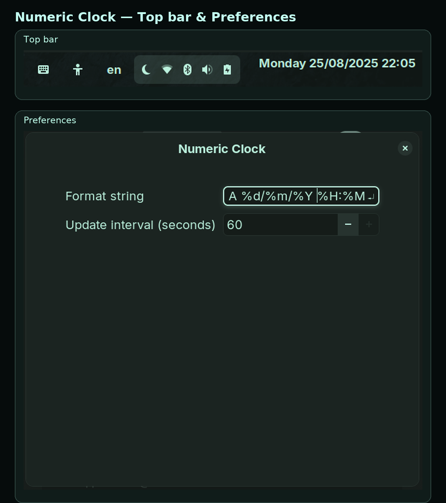

> Using GNOME **42–44**? See the [`legacy/42-44` branch](../../tree/legacy/42-44) and the legacy ZIP on Releases.

# Numeric Clock (GNOME Shell Extension)


A lightweight GNOME Shell extension that replaces the top-bar clock with a **numeric, fully configurable** format (e.g., `DD/MM/YYYY HH:MM`).
Works on **GNOME 45+** (Wayland & Xorg). Licensed under **MIT**.

**UUID:** `numeric-clock@nickotmazgin`

---

## Quick links

* **Install on GNOME Extensions (E.G.O.)**: [https://extensions.gnome.org/extension/8566/numeric-clock/](https://extensions.gnome.org/extension/8566/numeric-clock/)
* **Latest GitHub Release (ZIPs)**: [https://github.com/nickotmazgin/Linux-Numeric-Date-And-Clock/releases/latest](https://github.com/nickotmazgin/Linux-Numeric-Date-And-Clock/releases/latest)
* **Issues / feedback**: [https://github.com/nickotmazgin/Linux-Numeric-Date-And-Clock/issues](https://github.com/nickotmazgin/Linux-Numeric-Date-And-Clock/issues)

---

## Screenshot



---

## Features

* Fully numeric date/time (you choose the `strftime` **format string**).
* **Instant-apply** preferences — changes apply as you type.
* Configurable **update interval** (seconds).
* Plays nice with other panel clocks (keeps visible labels in sync).
* Safe text rendering (forces plain text; no Pango markup).

---

## Compatibility & builds

| Build               | GNOME     | Schema ID                                  | Notes                                                  |
| ------------------- | --------- | ------------------------------------------ | ------------------------------------------------------ |
| **Main (v1.2.3)**   | **45+**   | `org.gnome.shell.extensions.numeric-clock` | Published on E.G.O.; icon included in `metadata.json`. |
| **Legacy (v1.1.1)** | **42–44** | `org.nick.numericclock`                    | Manual ZIP for older shells (schemas pre-compiled).    |

> Using GNOME **45 or newer?** Install from **E.G.O.** (recommended).
> Using **42–44?** Use the **Legacy** ZIP from the releases page.

---

## Install

### A) From **extensions.gnome.org** (recommended for 45+)

Open **Extensions** (or **Extension Manager**) → **Browse** → search **“Numeric Clock”** → toggle **On** → **Preferences** to configure.
Direct link: [https://extensions.gnome.org/extension/8566/numeric-clock/](https://extensions.gnome.org/extension/8566/numeric-clock/)

### B) From a **GitHub release** (manual — 45+)

Download the latest **45+ ZIP** (e.g., `numeric-clock@nickotmazgin-gnome45-v1.2.3.zip`) and install:

```bash
gnome-extensions install --force numeric-clock@nickotmazgin-gnome45-*.zip
gnome-extensions enable numeric-clock@nickotmazgin
gnome-extensions prefs  numeric-clock@nickotmazgin
```

### C) **Legacy GNOME 42–44** (manual)

Download `numeric-clock@nickotmazgin-legacy-42-44.zip` and install:

```bash
gnome-extensions install --force numeric-clock@nickotmazgin-legacy-42-44.zip
gnome-extensions enable numeric-clock@nickotmazgin
gnome-extensions prefs  numeric-clock@nickotmazgin
```

*(The legacy ZIP already contains `schemas/gschemas.compiled` for 42–44.)*

---

## Usage

Open **Preferences** and set:

* **Format string** — `strftime` pattern.
* **Update interval (seconds)** — how often to refresh.

Changes apply immediately as you type.

### Quick `strftime` cheatsheet

`%A` weekday • `%a` short weekday • `%d` day • `%m` month • `%Y` year • `%H` hour (00–23) • `%M` minute • `%S` second

Examples:

* `%A %d/%m/%Y %H:%M` → `Sunday 24/08/2025 22:04`
* `%Y-%m-%d %H:%M:%S` → `2025-08-24 22:04:09`
* `%d.%m.%Y  %H:%M` → `24.08.2025  22:04`

---

## Troubleshooting

See two clocks? Disable other clock extensions:

```bash
gnome-extensions list | grep -i clock
gnome-extensions disable clock-override@gnomeshell.kryogenix.org || true
```

Reset to defaults (45+ schema):

```bash
gsettings reset-recursively org.gnome.shell.extensions.numeric-clock
```

Manually set values (45+):

```bash
gsettings set org.gnome.shell.extensions.numeric-clock format-string '%A %d/%m/%Y %H:%M'
gsettings set org.gnome.shell.extensions.numeric-clock update-interval 60
```

Logs:

```bash
journalctl --user -b 0 -o cat | grep -i numeric-clock
```

---

## Packaging & releases (for maintainers)

1. **Bump** the integer `"version"` in `numeric-clock@nickotmazgin/metadata.json` (this is what E.G.O. reads).
2. Ensure repo URL and icon are set:

   ```json
   "url": "https://github.com/nickotmazgin/Linux-Numeric-Date-And-Clock",
   "icon": "icon.png"
   ```
3. **Build (45+)** from inside `numeric-clock@nickotmazgin/`:

   ```bash
   rm -f schemas/gschemas.compiled
   gnome-extensions pack . --force --out-dir ..
   # Produces: ../numeric-clock@nickotmazgin.shell-extension.zip
   ```
4. **Legacy 42–44** (from the `legacy/42-44` branch): ensure `gschemas.compiled` is present inside the ZIP.
5. Create a **GitHub Release** and upload the relevant ZIP(s).
   On E.G.O., submit the **45+** build.

> **Note:** Do **not** commit `schemas/gschemas.compiled` in the repo; it’s a build artifact.

---

## Privacy

No network access. The extension only formats and sets the top-bar label.

## License

MIT © Nick Otmazgin

## Support

If you enjoy the extension and want to support development:
**PayPal:** [https://www.paypal.com/paypalme/nickotmazgin](https://www.paypal.com/paypalme/nickotmazgin)

## Links

* **Releases:** [https://github.com/nickotmazgin/Linux-Numeric-Date-And-Clock/releases](https://github.com/nickotmazgin/Linux-Numeric-Date-And-Clock/releases)
* **Issues:** [https://github.com/nickotmazgin/Linux-Numeric-Date-And-Clock/issues](https://github.com/nickotmazgin/Linux-Numeric-Date-And-Clock/issues)
* **Website (E.G.O. “Website” button):** [https://github.com/nickotmazgin/Linux-Numeric-Date-And-Clock](https://github.com/nickotmazgin/Linux-Numeric-Date-And-Clock)

## Contact

[nickotmazgin.dev@gmail.com](mailto:nickotmazgin.dev@gmail.com)
