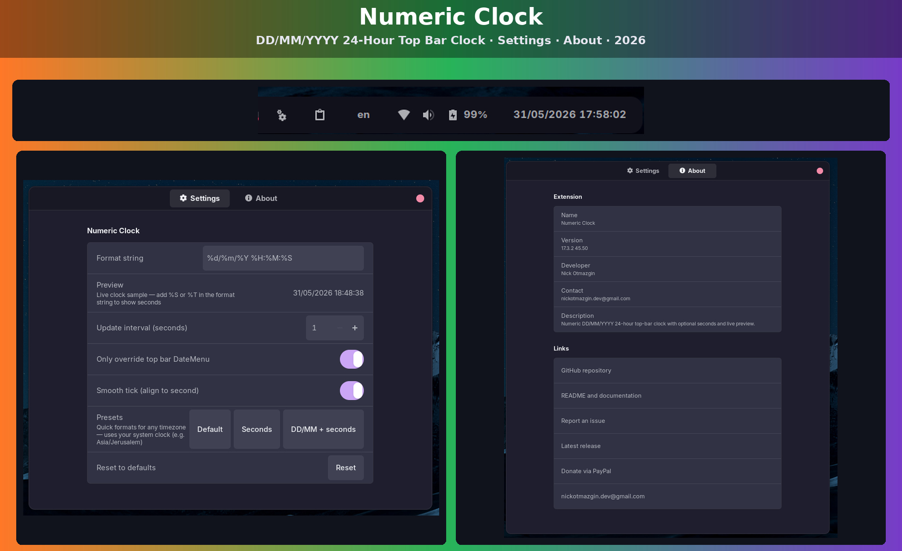

# Numeric Clock (GNOME Shell Extension)

[](https://github.com/nickotmazgin/Linux-Numeric-Date-And-Clock/releases/latest)


A lightweight GNOME Shell extension that replaces the top-bar clock with a **numeric, fully configurable** format — ideal for **DD/MM/YYYY** and **24-hour** time with optional **seconds**.

**Latest:** v17.3.2 — ESM build v22 for **GNOME 45–50** (Shell 46 tested on Zorin OS 18.1)

> Download only [v17.3.2](https://github.com/nickotmazgin/Linux-Numeric-Date-And-Clock/releases/latest).

**UUID:** `numeric-clock@nickotmazgin` · **License:** MIT

> **Keywords:** GNOME clock · numeric date · DD/MM/YYYY · 24-hour time · seconds · top bar · Israel timezone · Linux desktop · open source

> Using GNOME **42–44**? See the [`legacy/42-44` branch](../../tree/legacy/42-44).

---

## Quick links

* **Latest release (ZIPs):** [GitHub Releases](https://github.com/nickotmazgin/Linux-Numeric-Date-And-Clock/releases/latest)
* **Issues:** [Report a bug](https://github.com/nickotmazgin/Linux-Numeric-Date-And-Clock/issues)
* **Discussions:** [Ask a question](https://github.com/nickotmazgin/Linux-Numeric-Date-And-Clock/discussions)

---

## Screenshot



---

## Features

* Fully numeric date/time — you choose the `strftime` **format string**
* **Israel-friendly defaults:** `DD/MM/YYYY HH:MM:SS` (24-hour, seconds, system timezone e.g. `Asia/Jerusalem`)
* **Live preview** in settings — ticks every second when format shows seconds
* Configurable **update interval** (1–300 seconds)
* **Smooth second tick** alignment when showing seconds
* Presets: Default, Seconds (with weekday), **DD/MM + seconds** (any timezone)
* **Restore default clock** when disabled or uninstalled
* Safe plain-text rendering (no Pango markup)
* No network access, telemetry, or external services

---

## Compatibility & builds

| Build (branch)              |     GNOME | Extension version | Packaging notes                                               |
| --------------------------- | --------: | ----------------: | ------------------------------------------------------------- |
| **Main** (`main`)           | **45–50** |                22 | Do not include `schemas/gschemas.compiled`. Metadata omits `icon`. |
| **Legacy** (`legacy/42-44`) | **42–44** |                18 | Must include `schemas/gschemas.compiled` inside the ZIP.      |

---

## Install

### From GitHub release (recommended)

```bash
# GNOME 45–50 (ESM)
gnome-extensions install --force dist/numeric-clock@nickotmazgin.v21.shell-extension.zip

# GNOME 42–44 (legacy)
gnome-extensions install --force dist/numeric-clock@nickotmazgin.v18.shell-extension.zip

gnome-extensions enable numeric-clock@nickotmazgin
gnome-extensions prefs numeric-clock@nickotmazgin
```

### Build locally

```bash
./tools/build.sh
./tools/validate.sh
gnome-extensions install --force dist/numeric-clock@nickotmazgin.v21.shell-extension.zip
gnome-extensions enable numeric-clock@nickotmazgin
```

> **Note:** 45+ ZIPs **must not** contain `schemas/gschemas.compiled`.
> 42–44 ZIPs **must** contain `schemas/gschemas.compiled`.

After install, restart GNOME Shell: **Alt+F2** → `r` → Enter (Xorg) or log out/in (Wayland).

---

## Usage

Open **Preferences** and set:

* **Format string** — any `strftime` pattern
* **Update interval (seconds)** — use `1` when showing seconds
* **Smooth tick** — align updates to second boundaries

Changes apply immediately as you type.

### Israel setup (example)

Set your system timezone to `Asia/Jerusalem`, then use the **Israel** preset or:

```bash
gsettings set org.gnome.shell.extensions.numeric-clock format-string '%d/%m/%Y %H:%M:%S'
gsettings set org.gnome.shell.extensions.numeric-clock update-interval 1
gsettings set org.gnome.shell.extensions.numeric-clock smooth-second true
gsettings set org.gnome.shell.extensions.numeric-clock only-topbar true
```

Example output: `30/05/2026 18:20:06`

### Quick `strftime` cheatsheet

`%A` weekday · `%a` short weekday · `%d` day · `%m` month · `%Y` year · `%H` hour (00–23) · `%M` minute · `%S` second

Examples:

* `%d/%m/%Y %H:%M:%S` → `30/05/2026 18:20:06`
* `%A %d/%m/%Y %H:%M:%S` → `Saturday 30/05/2026 18:20:06`
* `%Y-%m-%d %H:%M:%S` → `2026-05-30 18:20:06`

---

## Troubleshooting

**Clock missing or doubled?**

```bash
gnome-extensions list | grep -Ei 'clock|date|time'
gnome-extensions disable <conflicting-extension-uuid>
```

**Reset preferences:**

```bash
gsettings reset-recursively org.gnome.shell.extensions.numeric-clock
```

**Check status:**

```bash
gnome-extensions info numeric-clock@nickotmazgin
gnome-extensions list --enabled
```

**Logs:**

```bash
journalctl --user -b 0 -o cat | grep -i numeric-clock
```

---

## Packaging & releases (maintainers)

```bash
./tools/build.sh    # -> dist/numeric-clock@nickotmazgin.v20.shell-extension.zip (ESM)
                    # -> dist/numeric-clock@nickotmazgin.v18.shell-extension.zip (legacy)
./tools/validate.sh
```

Tag `v*.*.*` to trigger CI upload of ZIPs to GitHub Releases.

Do **not** commit `schemas/gschemas.compiled` to the repo.

---

## Privacy

No network access. Only local preferences are stored.

---

## License

MIT © Nick Otmazgin — see [LICENSE](LICENSE).

---

## Support

**PayPal:** https://www.paypal.com/donate/?hosted_button_id=4HM44VH47LSMW

---

## Contact

[nickotmazgin.dev@gmail.com](mailto:nickotmazgin.dev@gmail.com)

---

## Find this project

**GitHub topics:** `gnome-shell-extension` · `clock` · `24-hour` · `numeric-date` · `top-bar` · `seconds` · `wayland` · `linux` · `open-source`

**Search for:** GNOME numeric clock, Linux top bar date format, DD/MM/YYYY clock extension, 24 hour clock GNOME

## More GNOME extensions by Nick Otmazgin

- [ClipFlow Pro](https://github.com/nickotmazgin/clipflow-pro) — clipboard history manager with pins, stars & privacy
- [Comfort Control (EaseHub)](https://github.com/nickotmazgin/comfort-control-easehub) — panel menu for power, screenshots, updates & utilities
